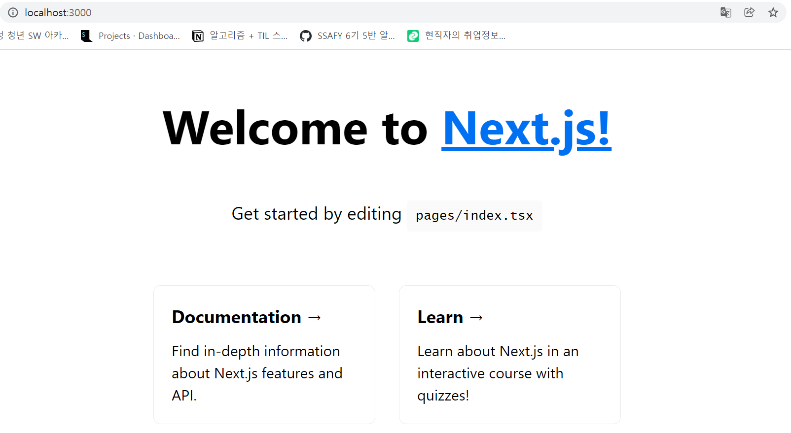

# React_01

### 1) React

- 개념 : 사용자 인터페이스를 구축하기 위한 선언적이고 효율적이며 유연한 JavaScript 라이브러리

- 컴포넌트를 이용하여 복잡한 UI를 구성하도록 돕는 역할

- MVC 애플리케이션의 뷰 레이어

- state 및 props를 사용하여 데이터 저장 및 처리 방법을 간소화

- 컴포넌트 생성 예시 코드

  ```react
  import React, {Component} from 'react'
  import ReactDOM from 'react-dom'
  import './index.css'
  
  class App extends Component {
    render() {
      return (
        <div className="App">
          <h1>Hello, React!</h1>
        </div>
      )
    }
  }
  
  ReactDOM.render(<App />, document.getElementById('root'))
  ```

  

### 2) Next.js

- React의 SSR을 쉽게 구현할 수 있게 도와주는 간단한 프레임워크

- 두 가지 형태의 사전 렌더링

  > 정적 생성 : HTML은 빌드 시 생성되며 각 요청에서 재사용
  >
  > 서버 측 렌더링 : HTML은 각 요청에 대해 생성

- 직관적인 페이지 기반 라우팅 시스템

- 사전 렌더링, 정적 생성 및 서버 측 렌더링이 모두 페이지 단위로 지원

- 빠른 페이지 로드를 위한 코드 자동 분할

  

### 3) TypeScript

- JavaScript를 기반으로 정적 타입 문법을 추가한 프로그래밍 언어

- 코드 작성 단계에서 타입을 체크해서 오류를 확인할 수 있기 때문에 실행 전에 많은 오류들을 찾을 수 있음

- 유효한 자바스크립트 코드는 확장자를 .ts로 변경하고 타입스크립트로 컴파일해 변환 가능

- React App에서 간단한 옵션 추가만으로 타입스크립트 사용 가능

  ```
  npx create-next-app@latest --ts
  # or
  yarn create next-app --typescript
  ```

  

### 4) 결과

- vs 코드로 프로젝트 열고, terminal에 아래 코드 입력 

```
cd my-app
npm run dev
```




