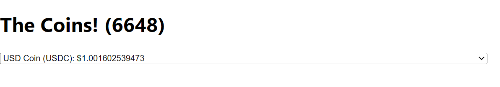
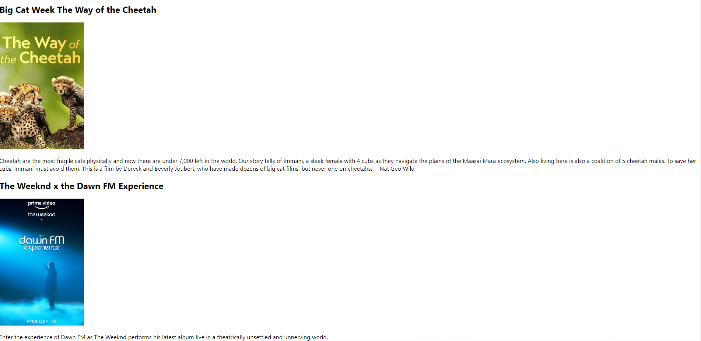

# React_04

### 1) To-Do list 만들기

```javascript
import { useState } from "react";


function App () {
  const [toDo, setToDo] = useState("")
  const [toDos, setToDos] = useState([]);
  const onChange = (event) => setToDo(event.target.value);
  const onSubmit = (event) => {
    event.preventDefault();
    if (toDo === "") {
      return;
    }
    setToDos((currentArray) => [toDo, ...currentArray]);   // 리스트에 항목 추가
    setToDo("");
  };
  console.log(toDos);
  return (
    <div>
      <h1>My To Dos ({toDos.length})</h1>
      <form onSubmit={onSubmit}>
        <input onChange={onChange} value={toDo} type="text" placeholder="Write your to do..." />
        <button>Add To Do</button>
      </form>
      <hr />
      <ul>
        { toDos.map((item, index) => (
          <li key={index}>{item}</li>
        ))}
      </ul>
    </div>
  );
}

export default App;
```

- 리스트에 항목 추가하는 방법 : `setToDos((currentArray) => [toDo, ...currentArray]);`

  > push 사용하지 않음

- map( ) : 괄호 안에 함수를 넣어서 array의 모든 요소(item)에 대해 함수를 실행시킴


### 2) Coin Tracker (api 호출)

```javascript
import { useEffect, useState } from "react";


function App () {
  const [loading, setLoading] = useState(true);
  const [coins, setCoins] = useState([]);
  useEffect(() => {
    fetch("https://api.coinpaprika.com/v1/tickers")   // api 호출
      .then((response) => response.json())   // json 형태로 변환
      .then((json) => {
        setCoins(json);
        setLoading(false);
      });
  }, []);          // 처음으로 로드할 때만 데이터 불러오기 위해서 deps는 []
  return (
    <div>
      <h1>The Coins! { loading ? "" : `(${coins.length})`}</h1>
      { loading ? <strong>Loading...</strong> : <select>
        { coins.map((coin) => (
          <option>
            {coin.name} ({coin.symbol}): ${coin.quotes.USD.price}
          </option>
        ))}
      </select> }
    </div>
  );
}

export default App;
```

- fetch : 자바스크립트 내장 객체, api 호출

  > 첫 번째 인자로는 URL 주소를, 두 번째 인자로는 옵션 객체를 받는다.
  >
  > 옵션 객체 : HTTP 방식(method), HTTP 요청 헤더(headers), HTTP 요청 전문(body)

- coins라는 리스트에 있는 요소들(coin)에 <option>~ 함수 실행해서 데이터 값 화면에 뿌리기

  


### 3) Movie App 만들기

```javascript
// App.js

import { useState, useEffect } from "react";


function App () {
  const [loading, setLoading] = useState(true);
  const [movies, setMovies] = useState([]);
  const getMovies = async () => {
    const json = await (
      await fetch(
      `https://yts.mx/api/v2/list_movies.json?minimum_rating=8.5&sort_by=year`
      )
    ).json();         // response 데이터 json으로 변환하기
    setMovies(json.data.movies); // movies 리스트 setMovies 통해 json.data.movies로 바꾸기
    setLoading(false);          // 영화 데이터 불러오면 loading은 false로 바꿔주기
  };
  useEffect(() => {
    getMovies();
  }, []);
    return <div>
      { loading ? (<h1>Loading...</h1>) : (
        <div>{movies.map((movie) => ( 
          <div key={movie.id}>
            <h2>{movie.title}</h2>
            
            <p>{movie.summary}</p>
          </div>
        ))}
        </div>
      )}
  </div>;
}

export default App;
```

- map을 통해 리스트에 있는 모든 요소들 함수 실행시킬 때, key 작성해야 함

- 로딩 중이라면 `<h1>Loading...</h1>` 출력하고, 로딩 중이 아니라면 영화 목록 출력하기

  




### 4) Movie App 만들기 (컴포넌트와 라우터 사용)

```javascript
// App.js

import { BrowserRouter as Router, Switch, Route } from "react-router-dom";
import Home from "./routes/Home";
import Detail from "./routes/Detail";

function App () {
  return (
    <Router>
      <Switch>
        <Route path="/movie/:id">
          <Detail />
        </Route>
        <Route path="/">
          <Home />
        </Route>
      </Switch>
    </Router>
  );
}

export default App;
```

- Vue에서 상위 컴포넌트에서 하위 컴포넌트로 데이터를 내리는 것처럼 사용
- `Switch` : 한번에 하나씩 라우터를 렌더링시키는 것

```javascript
// routes/Detail.js


import { useEffect } from "react";
import { useParams } from "react-router-dom";

function Datail () {
  const {id} = useParams()
  const getMovie = async () => {
    const json = await(
      await fetch(`https://yts.mx/api/v2/movie_details.json?movie_id=${id}`)
    ).json();
    console.log(json)
  };
  useEffect(() => {
    getMovie();
  }, []);
  return <h1>Detail</h1>;
}

export default Datail;
```

- url 주소가 `/movie`인 경우 보여지는 페이지

- useParams : URL의 동적 매개 변수에 액세스 할 수있는 React Router Hook

  > url 파라미터에 접근할 수 있음

```javascript
// routes/Home.js


import { useState, useEffect } from "react";
import Movie from '../components/Movie';


function Home () {
  const [loading, setLoading] = useState(true);
  const [movies, setMovies] = useState([]);
  const getMovies = async () => {
    const json = await (
      await fetch(
      `https://yts.mx/api/v2/list_movies.json?minimum_rating=8.5&sort_by=year`
      )
    ).json();
    setMovies(json.data.movies);
    setLoading(false);
  };
  useEffect(() => {
    getMovies();
  }, []);
    return <div>
      { loading ? (<h1>Loading...</h1>) : (
        <div>{movies.map((movie) => ( 
          <Movie
            key={movie.id}
            id={movie.id}
            coverImg={movie.medium_cover_image}
            title={movie.title}
            summary={movie.summary}
          />
        ))}
        </div>
      )}
  </div>;
}

export default Home;
```

- url 주소가 `/`인 경우 보여지는 페이지
- Movie 컴포넌트로 데이터 내리는 상위 컴포넌트

```javascript
// components/Movie.js


import PropTypes from "prop-types";
import {Link} from "react-router-dom";

function Movie({ id, coverImg, title, summary }) {
  return (
    <div>
      
      <h2><Link to={`/movie/${id}`}>{title}</Link></h2>
      <p>{summary}</p>
    </div>
  );
}

Movie.propTypes = {
  id: PropTypes.number.isRequired,
  coverImg: PropTypes.string.isRequired,
  title: PropTypes.string.isRequired,
  summary: PropTypes.string.isRequired,
};

export default Movie;
```

- 하위 컴포넌트
- 상위 컴포넌트로부터 데이터를 받으면 propTypes를 통해 해당 데이터의 타입 정의해야 함